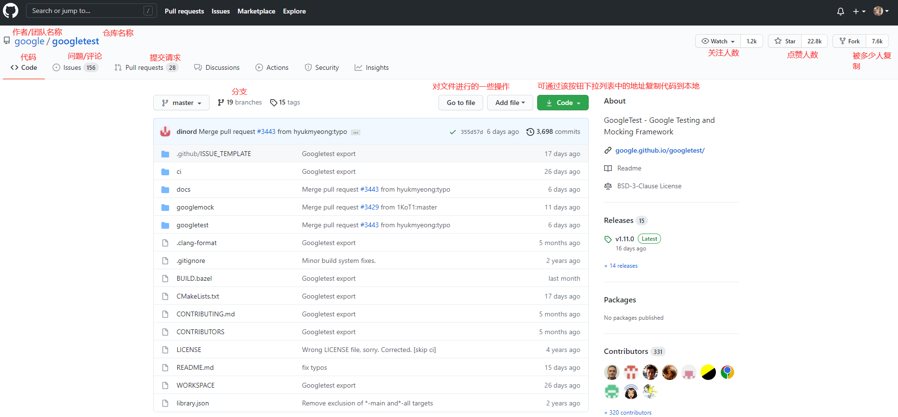
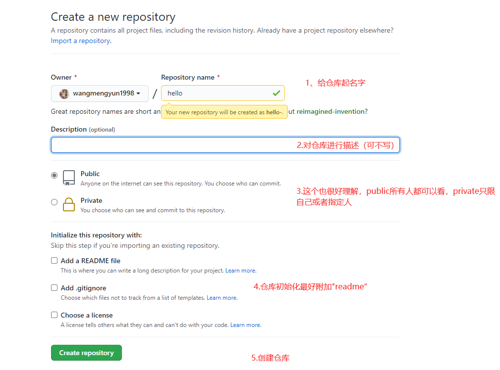
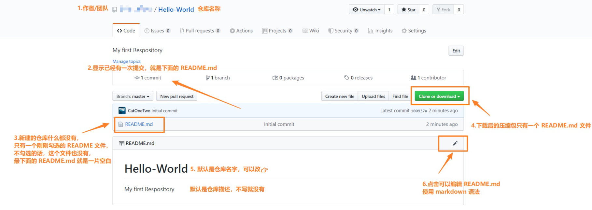
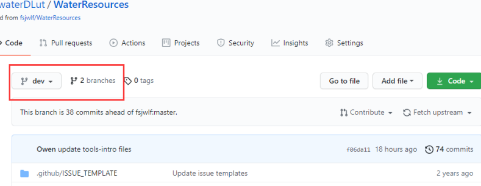
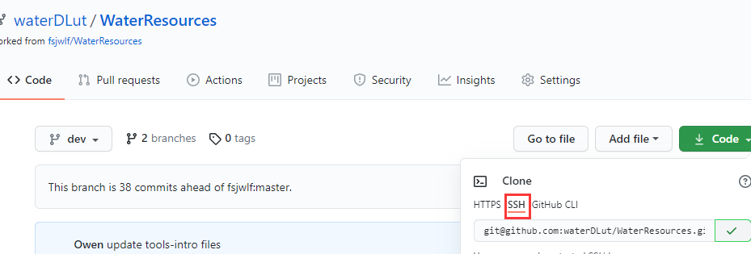
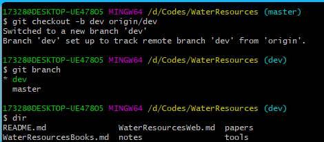

# GIT & GITHUB

和许多小白一样，刚接触github时是这样的  

    

经过几个月的摸索，现在觉得github   

       

下面记录一下自己学习github的历程     

主要参考了[GIThub入门](https://zhuanlan.zhihu.com/p/139494507)        
  

# (一) 初识界面

## 1. git和github

先来区分下git和github：两者是不一样的两个东西；**git**是一个软件/工具/系统，**gitHub** 是一个网站/平台，gitHub 这个网站使用了 git 这个工具。  

## 2. 加入github

### 2.1 注册

打开[Github官网](https://github.com/),首页如下图所示，点击右上角```Sign up```按钮，进入注册页面。使用电子邮件注册，设置好用户名和密码，即可生成账号。完成注册后，点击旁边的```Sign in```按钮登录。      

  

如果需要验证邮箱（**verify your email address**），就会在注册邮箱中收到github邮件，点击 ```verify email address``` 即可。

### 2.2 登录 GitHub，浏览页面

### 2.2.1 主界面

注册完成后，输入账号密码就能进入github了！！！  

登录进去后，我们见到的页面分成三大版块，如下图所示，从左至右依次为：**自己的仓库(Repositories)、关注的人的动态、发现新的热门/有趣仓库。**     

   

中间的四个按钮：  
**Pull requests**：你想参与别人的项目，或想改进别人的项目，改进后需要提交申请，用 pull requests。   

**Issues**：你发现别人项目的 bug，或者有什么问题，怎么和作者交流呢？提一个 Issue ；别人也可以给你的项目提 Issue 反馈问题。Issue 追踪各种想法，增强功能，任务，bug，有点儿像评论功能。   

**Marketplace**：应用商店，里面有免费/收费的开发工具。  

**Explore**：你可以理解成软件里的发现页，点进去推荐一些和你相关的话题、项目、新闻等。  

### 2.2.2 个人界面

点击头像旁边的箭头，会出现一个小页面  

    

选择```Your profile```项，到达个人主页。下图所示为我的个人主页。   

  

### 2.2.3 项目界面

我们使用 GitHub ，无论存放东西，还是查资料，主要都是看自己或别人的项目/仓库，所以这个界面一定要熟悉。   


你可以通过搜索项目、点击别人的界面、推荐页面打开一个项目。  

以“google”为例，如下图所示  

  

点击进入热度最高的项目，可看到如下界面  

   

滑到最下面，可以看到一个叫 ```README.md``` 的一段文字，仔细看，它就是仓库里的一个文件，只不过展示出来了。它就像产品说明书，或者是一个介绍页，告诉你这个仓库的有关信息，让你对仓库有了简单的了解。   

以后你要建个仓库，为了方便别人了解，也要写这样的文件。   

# (二) 仓库操作

在初识github界面之后，接下来是对仓库的创建、修改、删除等的基本操作。

## 1. 创建仓库

可以通过图片所示按钮创建仓库   

  

任选一入口点击进入，界面和操作步骤如下   

      


仓库的创建还是比较容易的，接下来就看看自己创建的仓库是什么样子。  

      


当打开个人界面，就可以在**overview**看到创建的仓库了，点击个人界面```Repository```或者打开主页面也可以看到，之后就可以对仓库进行一系列的操作了.......  

## 2. 基本操作

**仓库名称修改**：进入仓库，找到```Settings```按钮，点击进入，输入新名称，点击```Rename```按钮即可。 

**删除仓库**：同样找到```Settings```按钮，点击进入，删除按钮在页面最下面，不过需要输入作者/仓库名，防止误删。    

当然还有一些其他操作，详情可点击[这里](https://zhuanlan.zhihu.com/p/139767171)

# (三) GIT的安装及使用

如概述中介绍的那样，Github是我们进行代码托管的平台，而我们要在本地处理文件，进行版本控制的时候就需要**git工具**大展身手了。

## 1. Git的安装

点击[Git下载](https://git-scm.com/downloads)，找到自己操作系统对应的版本下载安装即可，安装时候一路默认配置就行。     

安装完成之后，在开始菜单找到下面这个图标，点击进入（或者直接启动windows终端也行，更方便）

    

输入

```Shell
git --version
```

返回版本号说明安装成功！  


## 2. 配置用户信息

第一次使用git，通常需要配置用户名和邮箱信息：  

```Shell
git config --global user.name “Your Name”
git config --global user.email Youremail@example.com
```

配置好后，就可以开始使用git命令了。    

## 3. clone项目

进入到自己想要下载的repo页面后，以本项目为例，点击绿色的“Code”，然后把地址copy下来  


在本地打开terminal，进入你想放置本项目的文件夹,鼠标右击选择**Git Bash here**，打开的 GitBash 可以看到自动定位到我们的仓库位置，如果在其他位置打开，还得再次定位。接着使用 “git clone <刚刚copy的地址>”命令，就能把代码下载到本地了。

```Shell
git clone https://github.com/waterDLut/WaterResources.git
```

需要注意的是，如果用 HTTPS 地址需要输入用户名密码进行账户验证。而使用 SSH 地址只需要第一次时提交 SSH Key 到 GitHub ，后续无需每次验证，很方便，所以推荐使用SSH 地址。接下来就会介绍如何配置 SSH Key。

这种方式第一次配置相对麻烦一点，但是后续使用更加方便。

首先，使用如下命令创建密钥文件

```Shell
ssh-keygen -t rsa -C 你的github账号邮箱
```

输入后会提示保存key的文件以及passphrase，选择直接回车（一共三次），保存到默认位置，默认设置即可。

然后命令行上会显示处出密钥保存路径，其中私钥文件是 id_rsa，公钥文件是 id_rsa.pub

然后需要将SSH公钥添加到自己的GitHub账户。

- 复制id_rsa.pub文件中的全部内容
- 登陆到GitHub上，右上角小头像->Setting->SSH and GPG keys中，点击new SSH key，将复制的所有内容添加到其中；名称可以随便起

接下来测试链接：

```Shell
ssh -T git@github.com
```

将会看到如下提示：

The authenticity of host 'github.com (xxx.xxx.xxx.xxx)' can't be established.
RSA key fingerprint is xxxxxxxxxxxxxxxxxxxxxxxxxxxxxxxxxxxxxxx
Are you sure you want to continue connecting (yes/no)? 

输入yes，然后回车即可，这时候结果为 “ …You’ve successfully authenticated, but GitHub does not provide shell access”，则说明成功。

ssh下下载的方式和https下一样，在github中clone时选择SSH协议即可，比如下载本repo：

```Shell
git clone git@github.com:waterDLut/WaterResources.git
```

如果已经使用了https，想要切换成ssh 变化远程仓库地址 可以按照下面方式操作（参考了[这里](https://docs.github.com/cn/github/getting-started-with-github/managing-remote-repositories#switching-remote-urls-from-https-to-ssh)）。

先使用下面语句查看一下远程仓库   

```Shell
git remote -v
```

  


如果之前是直接使用https下载的repo，那么应该可以看到origin后面是“https:...”，现在切换:

```Shell
git remote set-url origin git@github.com:USERNAME/REPOSITORY.git  
```  

   


再次查看远程仓库，可以看到发生了如下变化

 


## 4. 提交你的修改

以下是我们在修改repo之后，推送自己的贡献到github上时经常会用到的操作，用到时来查询即可。

### add/commit/push

用git clone xxx将repo复制到本地做了修改，如何将本地修改后的代码推送到远程呢？

最常用的命令就是add/commit/push 三连了   

首先输入

``` Shell
git status 
```

查看仓库状态，可以看到在WaterResources文件夹下做的更改，且默认进入 Git 仓库的 master分支，即主分支。 

   

接着依次输入

``` Shell 
git add -A  # 不但可以跟单一文件，还可以跟通配符，更可以跟目录。一个点就把当前目录下所有未追踪的文件全部add了 
```

``` Shell
git commit -m "本次提交想要说明的东西" # 把文件提交到仓库
```

``` Shell
git push -u origin master # 把本地库的所有内容推送到远程库上
```

**一般我们在 push 之前都会用`git pull`命令 pull一下 ，这样不容易冲突。**

- git push：翻译为推，当你的代码更新，需要把本地的推到远程仓库  

- git pull：翻译为拉，当远程仓库有更新，你需要把远程的拉到本地进行合并  


### 创建分支并推送到远程分支

参考了[git创建分支并推送到远程分支](https://blog.csdn.net/ljj_9/article/details/79386306)。

branch 是分支的意思，多人合作时，你一个模块，别人一个模块，你们各建一个分支就能保证改动互不干扰，等最后做完，把你们的分支合并起来就好。    

首先在master分支上，保证工作目标是干净的，也没有需要commit的：

``` Shell
git branch
git status
```

然后新建一个本地分支：

```Shell
git checkout -b  <你的分支名称>
```

比如常见的新建一个“开发”分支：

```Shell
git checkout -b dev
```

虽然建立分支，但可以看到 * 还在 master 上，说明我们还处于主分支,输入

```Shell
git checkout  dev
```

切换到分支 dev 上，再次查看分支，* 在 dev 前，说明我们处于分支dev ，可以修改分支dev 的内容了。    

然后把新建的本地分支push到远程服务器，远程分支与本地分支同名（当然可以随意起名）：

```Shell
git push origin <你的分支名称>:<你的分支名称>
```  

使用git branch -a查看所有分支，会看到remotes/origin/<你的分支名称> 这个远程分支，说明新建远程分支成功。 

### 拉取远程分支

参考：https://blog.csdn.net/tterminator/article/details/52225720

```Shell
# 查看所有远程分支
git branch -r
```

第一种方式： 

```Shell 
git checkout -b 本地分支名x origin/远程分支名x  
```

使用该方式会在本地新建分支x，并自动切换到该本地分支x。 

采用此种方法建立的本地分支会和远程分支建立映射关系。  

方式二：

```Shell
git fetch origin 远程分支名x:本地分支名x  
```

使用该方式会在本地新建分支x，但是不会自动切换到该本地分支x，需要手动checkout。  

采用此种方法建立的本地分支不会和远程分支建立映射关系。
 

你在 dev分支完成了你的部分，但是主分支还是原来那样，这个时候就需要把你的代码合并到主分支 master上来，执行**git merge**就是合并分支用到的命令。  

需注意，合并分为两步！！！  

（1）切换到 master 分支，如果你已经在了就不用切换了;  
（2）执行 git merge dev ，意思就是把dev 分支的代码合并过来，不出意外，这个时候 dev分支的代码就顺利合并到 master 分支来了。   


有添加就有删除，假如分支新建错了，或者dev分支的代码已经顺利合并到 master 分支来了，那么 dev 分支没用了，用 git branch -d 删除。删除分支dev 的语句为 git branch -d dev 。  

### pull request

我们在之前已经介绍过如何创建分支并且推送到远程，那么现在自己的github上已经有了创建的dev分支，这个分支将是随后发起 Pull Request 时要用到的源分支。   

点击项目简介下的 **Pull Request** 按钮   


再点击**New Pull Request**    


点击**Create Pull Request**即可，自己的仓库默认设置为源仓库（head fork）、询问指定源分支（compare）、目标仓库（base fork）和目标分支（base）  


此时对方就会在在他自己的 GitHub 仓库下的**Pull Request**选项卡中看到所有的 **Pull Request**。点击  **Pull Request** 会显示这个Pull Request的简介、dev 分支的提交历史，以及包含的更改。    
如果对方认为 dev 分支已经可以合并了，他只需点击 **Merge Pull Request**按钮来通过这个 Pull Request，将dev分支并入他的 master 分支。    
最后，对方接受了这些修改，将 dev分支并入了 master 分支，关闭了这个 Pull Request。功能现在已经整合到了项目中，其他在 master 分支上工作的开发者可以使用标准的 git pull 命令将这些修改拉取到自己的本地仓库。 

### fork后同步源的新更新内容

fork了别人的repo，一段时间后，别人更新了，想要同步过来最新的内容，应该怎么做？  

参考：

- [gitlab或github下fork后如何同步源的新更新内容？](https://www.zhihu.com/question/28676261)
- [Configuring a remote for a fork](https://docs.github.com/en/github/collaborating-with-issues-and-pull-requests/configuring-a-remote-for-a-fork)
- [Syncing a fork](https://docs.github.com/en/github/collaborating-with-issues-and-pull-requests/syncing-a-fork)

首先，给fork配置远程库

查看远程状态:

```Shell
git remote -v
```

确定一个将被同步给 fork 远程的上游仓库:

```Shell
git remote add upstream git@github.com:waterDLut/WaterResources.git
```

然后再次查看远程状态，已经可以看到upstream的信息了。  

从上游仓库 fetch 分支：  

```Shell
git fetch upstream
```

转换到main(或者master)分支

```Shell
git checkout main
```

合并远程分支：  

```Shell
git merge upstream/main
# 或者
git rebase upstream/main
```

如果本地没有更改，那git就直接自动执行一个fast-forward，如果有更改，就手动调整一下有冲突的地方，然后commit即可。

最后push到自己的origin上即可。

```Shell
git push
```

### 查看历史版本

使用命令：

```Shell
git log
```

可以查看历史提交记录。

使用

```Shell
git checkout xxx（某个历史版本的哈希值，即git log下显示的每次commit对应的一串数字字母）
```

即可回到xxx的那个版本。

### 标签tag

使用如下命令可以查看已有标签：

```Shell
git tag
```

想要给当前已提交的版本打标签可以使用如下方式：

```Shell
git tag -a v1.4 -m "my version 1.4"
```

将刚刚创建的tag提交到github：

```Shell
git push origin v1.4
```

这样就会在github上看到tag小栏里出现新的tag了。  

如果标签打错了，想要删除，执行下面语句即可：

```Shell
git tag -d v1.4 
```

想要把远程github上的对应标签也删除，执行下面语句：

```Shell
git push origin :refs/tags/v1.4 
```


## 5. 团队协作方式

这里以和本repo的交互为例，简单小结一下前述内容，并介绍如何一起维护此repo。

### 创建开发分支（团队项目负责人来完成）

master分支一般用来发布稳定版本，dev分支（开发分支）用来发布开发版本。  

输入分支名称后，下面会跳出Create branch，点击即可创建。    

  

分支创建完毕后，会自动跳转到dev分支。由于dev分支是从master分支上创建的，因此内容与master分支一致。  

   
  
  
### Fork项目到个人的仓库

点击右上角的Fork，并选择你的账号（一般在第一个）。就可以Fork团队项目到个人仓库啦。  
 
   
 
###  Clone项目到本地

  
 
打开git命令行，输入指令和刚才复制的地址，回车即可克隆到本地。  

此时你只能看到master分支，并没有把dev分支clone下来。使用` git branch` 命令查看本地分支，发现本地只有master分支。

 

使用 `git branch -a `查看所有分支，就能看到远程分支。  
 
   

根据远程分支，我们可以用`git checkout -b dev origin/dev` 创建一个dev分支（-b），并把远程dev分支（origin/dev）的内容放在该分支内。接着切换到该分支（checkout）。    

现在使用 `git branch` 可以查看两个分支，并且用 `ls `或者 `dir` 就能看到dev分支的内容了。想切换回master分支的时候，再用 `git checkout master` 即可。    

 

上面的操作完成后，你就可以在本地进行开发了。但是如果要将你修改完的代码合并到团队项目上，还需要进行下面的操作。  

### 和团队项目保持同步

首先查看有没有设置upstream，使用` git remote -v` 命令来查看。    

 

如果没有显示upstream，则使用 `git remote add upstream` 团队项目地址命令。接着再次使用 `git remote -v `，显示出了upstream，那么就设置好了。  

  

开始同步。首先执行 `git fetch upstream` 获取团队项目最新版本。此时并没有把最新版本合并到你本地的分支上，因此还需要一步。 当前分支是dev分支，执行 `git merge upstream/dev` 命令后，会将源分支（upstream/dev）合并到当前分支（dev）。  

   

如果你是在本地的master分支上开发，那么在使用该命令前，先切换到master分支。merge的时候，有可能碰到冲突。需要解决冲突才能继续下面的操作。

### push修改到自己的项目上

解决冲突后，就可以使用 git push 命令将本地的修改同步到自己的GitHub仓库上了。注意，在当前所在分支使用push，会push到与这个分支相关联的远程仓库分支。这里dev分支与origin/dev关联，因此push到GitHub上的dev分支。  


 

（正在编辑中。。。，以下是预用版）

- 首先我们要在本机克隆这个项目（没有连接也可以的）：`git clone` 仓库的地址，然后初始化项目：`git init ` 

- 现在将你的本地仓库与他的远程仓库连接起来：`git remote add` 远程仓库地址，然后可以使用`git remote -v`查看你连接上的仓库  

- 连接仓库成功后，就可以添加要上传的文件了 `git add . `  (.表示添加所有文件，也可以直接跟文件名)  
 
- 本地提交  `git commit  -m  "提示信息"  `
  
- 然后`pull`一下，这一步主要是确认你本地有没有更新成最新的，如果不成功的话就很有可能是没有连接上仓库，`git  pull` (这里有时候要跟远程仓库的地址，有时候直接git pull 也可以) 

- 现在可以上传你的代码了`git push  `


